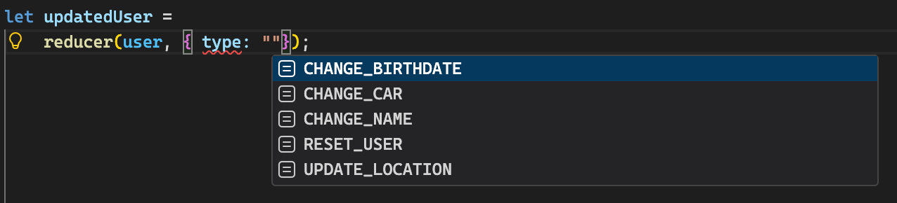
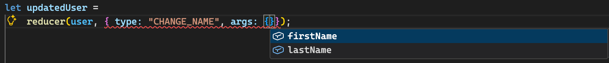
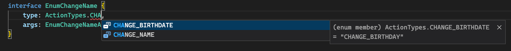
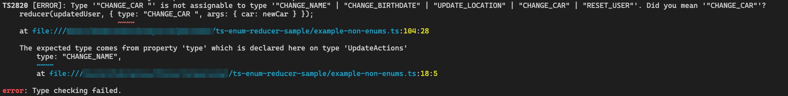

# A Sensible Way to Typify Your Reducer Actions
> _I've heard you liked types, so were are going to type your types so your types get typed while typing your code_  
## TL;DR
Using a reducer is a great way to centralized your update logic in a predictable manner, and avoid problematic updates around your codebase. This approach can be improved further with TypeScript to make sure not only that you have defined ways to change your state, but also so you get consistent help when applying these changes. Using a mix of derived types and enums/string literal relationships we can achieve a more straightforward approach to updating state into our application. You can find the complete example in this [GitHub repo](https://github.com/victorh18/ts-enum-reducer-sample).

## The Problem
The following example will demostrate how to use TypeScript to enforce a consistent way to change data in some User state.
Take as an initial example, a simple reducer, as shown in the `useReducer` [React documentation](https://react.dev/reference/react/useReducer#writing-the-reducer-function):
```js
const user = {
    firstName: "Bob",
    lastName: "Carpenter",
    birthDate: new Date("2000-01-01T00:00:00.000Z"),
    location: {
        country: "Canada",
        city: "Halifax",
    },
    car: {
        make: "Mazda",
        model: "CX-5",
        year: "2022"
    },
    createdAt: new Date(),
    modifiedAt: new Date()
}

function reducer(state, action) {
  switch (action.type) {
    case 'change_name': {
      return {
        ...state,
        firstName: action.args.firstName,
        lastName: action.args.lastName,
      };
    }
    case 'changed_birthdate': {
      return {
        ...state,
        birthdate: action.args.birthdate
      };
    }
  }
  throw Error('Unknown action: ' + action.type);
}
```

This basic reducer gives you the ability to define how you data can be updated. But this plain reducer allows you to easely shoot yourself in the foot, since it leaves the door open to:
- Mistyping an action name
- Mistyping a property name
- Adding unwanted properties into your update action
- Missing necessary properties into your update action  

And the lack of type checking means that you will only figure out these mistakes once you test your application, or even worse, never realize they are included in you code in case a specific code path is not executed.

## A Typed Approach
By applying some TypeScript code, you can save yourself some headaches and unpleasant surprises, and detect beforehand when an update operation is not quite right. Sure, it adds more code, that to a certain point can feel like boilerplate, but believe me, the **manteinability** and **consistency** will be worth it.

### Why Type Your Actions?
Typing your actions beforehand allow you to always check if a similar update operation is already present, which helps in avoiding duplicate logic, and to quickly identify which changes are already being done somewhere in your application. 

Let's start a refactor of the previous function by creating a string literal type with all the possible update operations:
```ts
type ActionTypes = 
    | "CHANGE_NAME"
    | "CHANGE_BIRTHDATE"
```
Now, let's create types to defined the expected structure to receive in each update operation:
```ts
type ChangeNameArgs = Pick<User, "firstName" | "lastName">;
type ChangeBirthDateArgs = Pick<User, "birthDate">;
```
Next, we are going to link each update operation type with the data strcuture it must receive:
```ts
interface ChangeName {
    type: "CHANGE_NAME",
    args: ChangeNameArgs
}

interface ChangeBirthDate {
    type: "CHANGE_BIRTHDATE",
    args: ChangeBirthDateArgs
}

// We also create this type to save us some space later
type UpdateActions = ChangeName | ChangeBirthDate 
```

### A Typed Reducer Function
With all of our supporting types created, we can finally refactor our reducer function, which will end looking like this:
```ts
const reducer: (initialValue: User, action: UpdateActions) => User = (initialValue, action) => {
    switch (action.type as ActionTypes) {
        case "CHANGE_NAME":
        case "CHANGE_BIRTHDATE":
            return {
                ...initialValue,
                ...action.args,
                modifiedAt: new Date(),
            };
    }
}
```
We can perform this simplified version of our reducer thanks to the fact that your typed relationships in `ActionTypes` take care of validating which properties will be updated, so the reducer function does not have to be responsible for this, and can just trust each action with the spread operator. This approach can be enhanced even more with the following refactor:
```ts
const reducer: (initialValue: User, action: UpdateActions) => User = (initialValue, action) => {
    switch (action.type as ActionTypes) {
        default:
            return {
                ...initialValue,
                ...action.args,
                modifiedAt: new Date(),
            };
    }
}
```
This is valid as long as you prepare your action type arguments in a way that works as expected with the spread operator!

### Extending Our Typed Reducer
After we have this code up and working in our codebase, eventually we'll need to add yet another possible mutation of our state. Luckily, once this structure has been established in our codebase, we just have to follow the standard for new `ActionTypes`:
```ts
type ActionTypes =
    | "CHANGE_NAME"
    | "CHANGE_BIRTHDATE"
    | "UPDATE_LOCATION"     // New ActionType
...
// New Argument/Payload Type
type UpdateLocationArgs = typeof user.location;
...
// New ActionType/Argument link
interface UpdateLocation {
    type: "UPDATE_LOCATION",
    args: { location: UpdateLocationArgs }
}
...
type UpdateActions = ChangeName | ChangeBirthDate | UpdateLocation
```

And just like that, we have another possible mutation that does not requires any modification to be done to the reducer function!

### Handling Exceptional Cases
Sometimes it's common to have mutations that do not rely on simply applying upcoming data to the new state, but instead apply a specific or derived value. Let's look at an example with a mutation that "resets" the user:
```ts
type ActionTypes =
    | "CHANGE_NAME"
    | "CHANGE_BIRTHDATE"
    | "UPDATE_LOCATION"
    | "RESET_USER";
...
type ResetUserArgs = any
...
interface ResetUser {
    type: "RESET_USER",
    args: ResetUserArgs
}
...
type UpdateActions = ChangeName | ChangeBirthDate | UpdateLocation | ResetUser
```
Our reducer function will then look like this:
```ts
const reducer: (initialValue: User, action: UpdateActions) => User = (initialValue, action) => {
    switch (action.type as ActionTypes) {
        case "RESET_USER":
            return {
                firstName: "",
                lastName: "",
                birthDate: new Date(),
                car: {
                    make: "",
                    model: "",
                    year: ""
                },
                createdAt: new Date(),
                location: {
                    city: "",
                    country: "",
                },
                modifiedAt: new Date()
            } as User
        default:
            return {
                ...initialValue,
                ...action.args,
                modifiedAt: new Date(),
            };
    }
}
```
Meaning that we can still handle exceptional mutation cases, even when using the spread operation for the general scenarios.
> _Wait a minute, please remind me, why are we adding all this boilerplate? Why can't I just have my reducer as-is and save myself from writing all this code?_

### The Goodies
Now that all of our actions are typed, and our actions' payloads are typed as well, we got some _very nice_ tooling available in our IntelliSense:
1. We can now avoid mistyping our action name thanks to IntelliSense autocompletion

2. We can autocomplete the fields needed in our payload

3. For most codebases, your reducer function is easier to maintain.
## Bonus
You can refactor all of this a bit further if you are not afraid of enums in TypeScript. Just using string literals, there still a mistype point of failure, which is mistyping your `ActionType` literal when linking it to your payload type, so something like this could happen:
```ts
type ActionTypes = 
    | "CHANGE_NAME"
    | "CHANGE_BIRTHDATE"

interface ChangeName {
    type: "CHANGE_NAME ",           //The extra space is a no-no
    args: ChangeNameArgs
}
```
You could shield yourself from this possible mistake by using `enums` instead of string literals, so you can have yet another level of mistyping protection:
```ts
enum ActionTypes {
    CHANGE_NAME = "CHANGE_NAME",
    CHANGE_BIRTHDATE = "CHANGE_BIRTHDAY",
    UPDATE_LOCATION = "UPDATE_LOCATION",
    RESET_USER = "RESET_USER",
}
interface EnumChangeName {
    type: ActionTypes.CHANGE_NAME,
    args: EnumChangeNameArgs
}

interface EnumChangeBirthDate {
    type: ActionTypes.CHANGE_BIRTHDATE,
    args: EnumChangeBirthDateArgs
}

interface EnumUpdateLocation {
    type: ActionTypes.UPDATE_LOCATION,
    args: { location: EnumUpdateLocationArgs }
}

interface EnumResetUser {
    type: ActionTypes.RESET_USER,
    args: EnumResetUserArgs
}
```
Which would allow you to do:


## Caveats
Yes, it's still possible to mess this up, specially in environments that do not automatically check the validity of TypeScript code before running it _(looking at you Vite)_. Even with this approach, you could commit the following mistake:
```ts
updatedUser =
    reducer(updatedUser, { type: "CHANGE_CAR ", args: { car: newCar } }); // Again the no-no space
```
And you could ignore the IntelliSense warning and the could would still run in some scenarios, leaving it up to you to eventually finding the error during testing, or worse, allowing the error to arrive to the end user if the code path was not reached by the tests. Hopefully, a TypeScript to JavaScript transpilation should be able to catch this:


## Conclusion
Some may see it as a "unnecessary load of boilerplate code", but as your application grows, so does the updating logic for its state, specially if it's centralized in a reducer-like manner. I personally choose this approach because it allows me to take this growth out of the reducer function, which helps with code organization, and because it is now is able to give me the IntelliSense and compilation check goodies that will make error identification more straightforward.

What do you think?
I'm interested to hear about possible improvements or challenges that this approach could have. If you have some feedback, please create an issue to the related GitHub repo and I'll gladly take a look!
